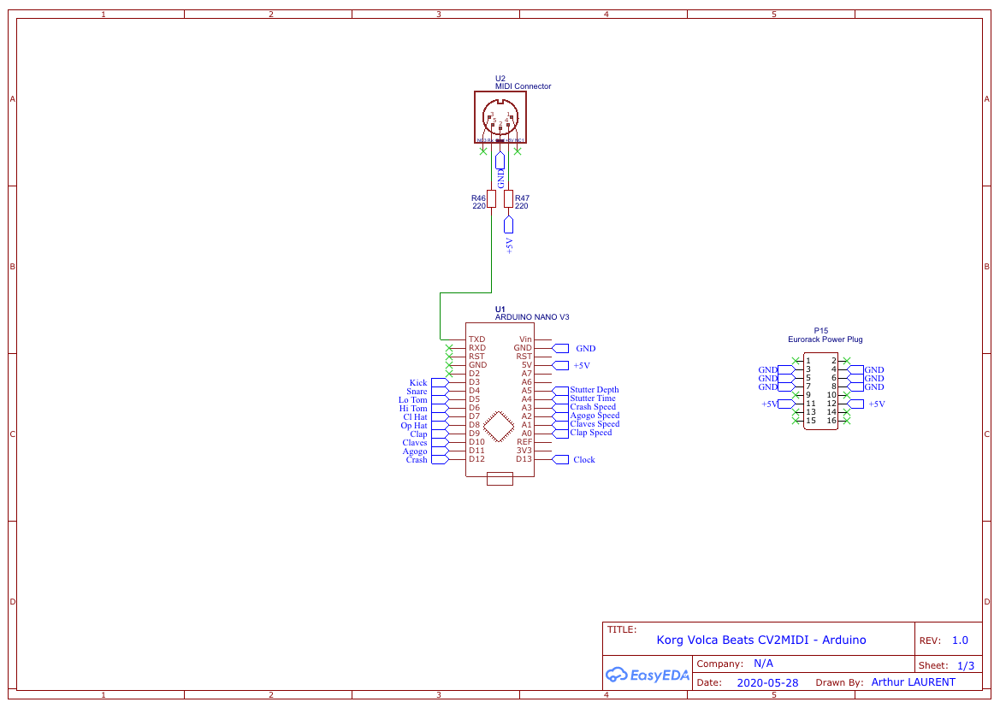
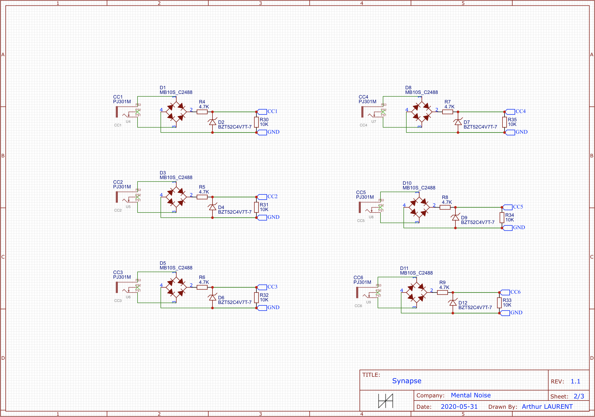
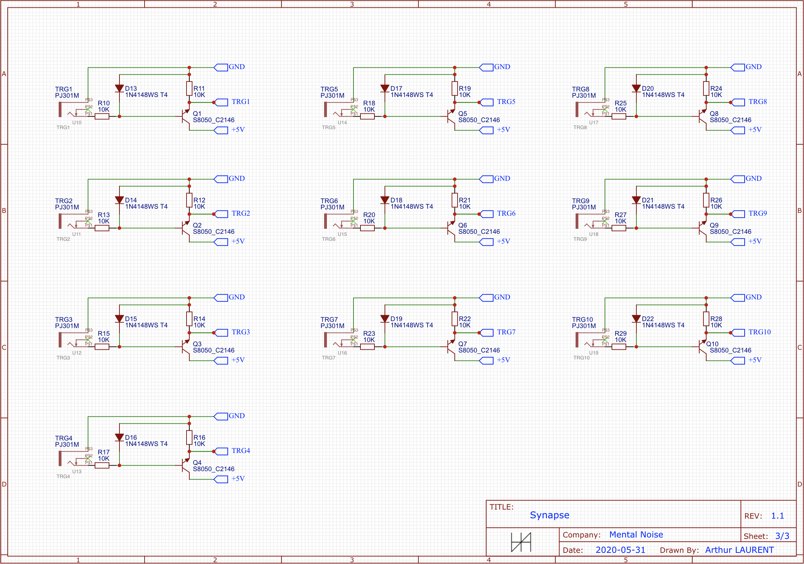

# Mental Noise - Synapse - CV2MIDI Eurorack module

This repository contains the code and schematics (EasyEDA format) for the Mental Noise - Synapse Eurorack module converting CV signals to MIDI commands any MIDI instrument can understand.

I originally made this module to control my Korg Volca Beats but after some discussions on Reddit, I decided to make it more generic so it's able to control basically any MIDI instrument using different profiles for each instrument.

I have made this module to work with my modular synth but it can work with any control voltage source between 0 and +5V.

This module does not require the instrument to be modded in any way, it is just using the MIDI IN connection to transmit informations received from the CV inputs, it is complitely safe to use.

The Arduino code uses the standard [MIDI library](https://github.com/FortySevenEffects/arduino_midi_library/blob/master/src/MIDI.h) and the [ResponsiveAnalogRead library by dxinteractive](https://github.com/dxinteractive/ResponsiveAnalogRead), which can both be found in the Arduino Library Manager.

Custom profiles can easily be created to control your specific instrument.

The code is written to allow easy customization even for someone who doesn't know anything about writing code for the Arduino but has some ideas on how/what to control the Volca Beats.

If this module gets a bit popular, I might consider writing an app to easily modify the firmware without writing a single line of code.

## Module available on Tindie

As I would love for anyone who wants to use this module to be able to, I'm selling some kits and fully assembled modules (in limited quantities) on [Tindie](https://www.tindie.com/stores/mentalnoise/).

The goal is not to make lot of benefits on this module, I'm already making it available for free here but if you don't have the skills to do it yourself with all the sources available here then it's a good way for you to get one!

If you don't want to buy the module but still want to support me, you can always send me tip on [paypal](https://paypal.me/atudoll), this is highly appreciated! :)

## Specifications

Checkout the [Documentation / Build guide](http://mentalnoise.atulrnt.com/Mental%20Noise%20-%20Synapse.pdf) for full specifications.

This module is designed to be used in an Eurorack system, it requires a +12V and a ground connection to the power supply.

The dimensions are:
- Width: 6HP
- Height: 3U
- Depth: 40mm

The MIDI device is controlled by this module using a MIDI cable (5-pin DIN connector).

Two types of inputs are available on the module:

#### CV x6
Analog input used to control parameters of the MIDI device. 
The MIDI command sent by those inputs is a Control Change.
Can be any voltage between 0 and +5V.
Higher voltages (up to +10V) will be clipped to +5V.

#### Gate x10
Digital input used to trigger a note on the MIDI device.
The MIDI command sent by those inputs is a Note ON.
A pulse of 20ms is triggered by any gate or trigger signal over 3V (up to +10V).

## Parts
-	1x PCB with pre-soldered SMD components
-	1x Unpopulated PCB for the Arduino and the 5V regulator
-	1x faceplate
-	1x Arduino Nano
-	1x USB cable to connect the Arduino Nano to a computer
-	1x 100 Ohm 1/4W resistor
-	2x 220 Ohm 1/4W resistor
-	1x 100nF ceramic capacitor
-	1x 10µF electrolytic capacitor
-	1x L7805 5V voltage regulator
-	16x Mono jack socket
-	16x Knurled nut
-	1x MIDI 5-pin DIN connector
-	3x wires to connect the MIDI connector to the module
-	6x heat shrink pieces
-	2x hex screws and nut to screw the MIDI connector on the module
-	2x 1x15 pin female header
-	3x 2x2 pin female header
-	1x 1x3 pin female header
-	1x 2x3 pin female header
-	6x 1x2 pin male header
-	3x 1x3 pin male header
-	1x 2x5 pin IDC connector (10 pin Eurorack connector)
-	1x 2x3 pin IDC connector (6 pin extension connector)
-	1x 10 pin to 16 pin or 10 pin to 10 pin Eurorack cable depending on your needs

## Schematics

Thank you and enjoy this module !
