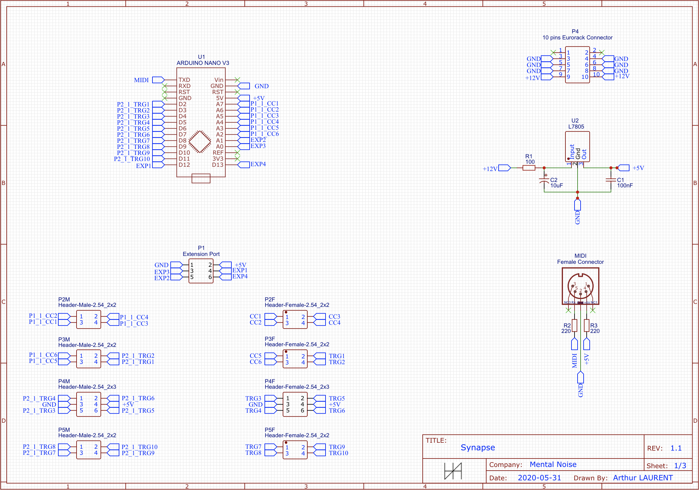

# WORK IN PROGRESS

# Korg Volca Beats CV2MIDI

This repository contains the code and schematics (EasyEDA format) for a DIY module converting CV signals to MIDI commands the Volca Beats understands.

I have made this module to work with my modular synth but it can work with any control voltage source.

My modular synth already has a +5V bus so I don't need a voltage regulator to convert +12V to +5V in this circuit.
If you don't have a +5V you will have to add the voltage regulator by yourself.

This module does not require the Volca Beats to be modded in any way, this module is just using the MIDI in connection of the Volca Beats to transmit informations received from the CV inputs, it is complitely safe to use.

The Arduino code uses the standard [MIDI library](https://github.com/FortySevenEffects/arduino_midi_library/blob/master/src/MIDI.h), which can be found in the Arduino Library Manager.

The different controls can easily be changed to some other of your choice. All parameters are described in comments in the code.

The code is written to allow easy customization even for someone who doesn't know anything about writing code for the Arduino but has some ideas on how/what to control the Volca Beats.

## Controls
The CV to MIDI converter gives the following controls over the Volca Beats :
* Trigger of each instrument
* Change of the PCM speed of each PCM instrument independently
* Change of the Stutter Time and Depth
* Clock trigger

## CV range
The CV inputs range is 0 to +5V.

Everything under this range is inverted.
Everything over this range is suppressed so you don't have to worry about frying your Arduino.

That also means that if you are using a module outputting CV signals up to 10V, you will reach the maximum value of the CV input at +5V, cutting your module resolution by 2.

The same goes for negative signals, the full bridge rectifiers will convert them to positive signals but they will have the same clipping at +5V to protect the Arduino. This means that negative signals will be interpreted the same as positive signals for the analog inputs, for the digital inputs they are simply ignored.

If the Eurorack standard for CV signals was well described and implemented, I could have map the entire CV range to a 0 to +5V range but from what I understand, this is not case.

Some modules have a range of 0 to +5V, some others 0 to +10V, -5 to +5V, -2.5V to +2.5V, -10V to 0 etc. which makes it impossible for me to handle correctly.
So I decided to simply use the Arduino input voltage range and it works pretty well with my setup that way.

## Parts
* 1x Arduino Nano
* 1x 5 pin MIDI connector 
* 1x Eurorack 16 pins connector
* 24x 1N4001 or equivalent rectifier diodes
* 11x BC547B or equivalent transistors
* 22x 10k resistors
* 11x 1k resistors (or higher value if you want to reduce the LEDs brightness)
* 11x 1N914 or equivalent diodes
* 17x LEDs of the color of your choice
* 17x Mono jack sockets

## Schematics

